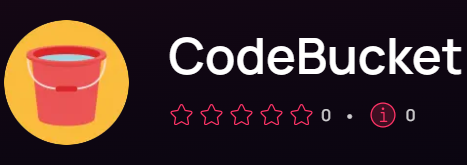

# Bot CodeBucket 🤖

Um bot desenvolvido com uso de JavaScript feito com o objetivo de auxíliar pessoas que querem estudar programação utilizando a plataforma Discord!

> [Repositório do site!](https://github.com/emanuelsacoman/CodeBucket-website)

## Hospedagem 🟢​

O bot foi hospedado usando o plano gratuíto de Gratian, atualmente minha indicação para quem deseja hospedar o próprio bot de graça.

> [Conheça o bot!](https://codebucketweb.web.app)

## Vote! 🏆​

Atualmente o bot está presente na top.gg, o que significa que o bot tem relevância. Com isso, fique a vontade para **votar**, dar um feedback e, dessa forma, me auxíliar.

> [Vote na top.gg!](https://top.gg/bot/1193011045577523300)

Não se esqueça de deixar uma ⭐ nesse repositório!